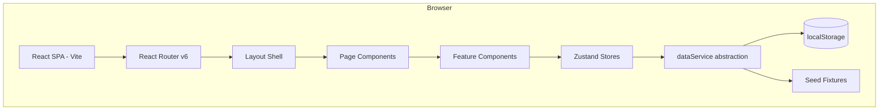

# Design Document — WISDOM Website

## Overview

WISDOM ("The future for the wise") is a prototype web platform for women and allies in STEM. It provides community discussion boards, professional networking, event discovery, mentorship enquiries, and team information. The platform must support a minor-safety layer, admin moderation, and a seeded data set so the prototype is immediately usable without real users.

This document covers the full technical design derived from the approved requirements, including architecture, component breakdown, data models, routing, state management, and testing strategy.

---

## Architecture

### Approach

The prototype is a **client-side Single Page Application (SPA)** with no dedicated backend server. All data is stored in the browser's `localStorage` and seeded from static fixture files on first load. This keeps the prototype self-contained and deployable as a static site (e.g., GitHub Pages, Netlify, Vercel) while still demonstrating all required features.

When the platform graduates from prototype to production, the data layer (described below as a `dataService` abstraction) can be swapped for real API calls without touching the UI components.

### Tech Stack

| Concern | Choice | Rationale |
|---|---|---|
| UI framework | **React 18** | Mature ecosystem, component model suits the page/widget breakdown |
| Build tool | **Vite** | Fast HMR, minimal config, first-class TypeScript support |
| Language | **TypeScript** | Type safety across data models and component props |
| Routing | **React Router v6** | Declarative nested routes, `<Outlet>` layout pattern, `<Navigate>` guards |
| Global state | **Zustand** | Minimal boilerplate, no provider wrapping, easy `localStorage` persistence via `persist` middleware |
| Styling | **Tailwind CSS** | Utility-first, easy to encode the WISDOM colour tokens as custom theme values |
| Icons | **Lucide React** | Lightweight, consistent icon set |
| Forms | **React Hook Form** | Performant, minimal re-renders, easy validation |
| Testing | **Vitest + React Testing Library** | Co-located with Vite, fast, supports property-based tests via `fast-check` |
| Property-based testing | **fast-check** | TypeScript-native PBT library |

### Colour Tokens (Tailwind config)

```js
// tailwind.config.js — extend.colors
{
  "wisdom-primary":   "#BE97C6",
  "wisdom-white":     "#FDFFFC",
  "wisdom-text":      "#4B5267",
  "wisdom-sidebar":   "#634587",
  "wisdom-highlight": "#325F85"
}
```

### High-Level Architecture Diagram



### Data Flow

1. On first load, `seedService.ts` checks `localStorage` for a `wisdom_seeded` flag. If absent, it writes all fixture data (users, threads, events, sponsors, spotlight profiles) and sets the flag.
2. All reads and writes go through `dataService.ts`, which wraps `localStorage` with typed getters/setters.
3. Zustand stores call `dataService` and hold the in-memory view of each entity collection.
4. React components subscribe to Zustand stores via hooks; they never touch `localStorage` directly.

---

## Components and Interfaces

### Application Shell

```
App
└── RouterProvider
    ├── PublicLayout          (no sidebar — for /login, /signup, /meet-the-team, /)
    │   ├── TopBar            (logo, "Sign In" / "Sign Up" links)
    │   └── <Outlet />
    └── AuthenticatedLayout   (requires auth)
        ├── Sidebar
        ├── TopBar            (logo, user avatar, notifications bell)
        └── <Outlet />
```

#### `<Sidebar>`

- Fixed left panel, width 240 px expanded / 64 px collapsed.
- Controlled by `uiStore.sidebarOpen` (Zustand).
- Toggle button at top of sidebar; state persisted to `localStorage`.
- Navigation links: Home, Discussion Boards, Connecting Platform, Events, Enquiries, Profile, Settings.
- Admin link visible only when `currentUser.role === 'admin'`.
- Background colour: `wisdom-sidebar` (`#634587`), text white.

#### `<TopBar>`

- Height 56 px, background `wisdom-primary`.
- Left: WISDOM logo / wordmark.
- Right (authenticated): notification bell icon with badge, user avatar → dropdown (Profile, Settings, Sign Out).
- Right (public): "Sign In" and "Sign Up" buttons.

### Page Components

#### `/` — Landing Page (public)

- Hero section: WISDOM tagline, "Join the Community" CTA button.
- Brief feature highlights (Discussion, Networking, Events).
- Footer with Meet the Team link and Sponsor logos.

#### `/signup` — Sign-Up Page

Components:
- `<SignUpForm>` — multi-step form (Step 1: name + age + location; Step 2: STEM disciplines; Step 3: tags + role).
- `<DisciplineSelector>` — two-level STEM category → sub-field picker.
- `<TagSelector>` — multi-select chip list from predefined tags.

#### `/login` — Login Page

- `<LoginForm>` — email + password fields, "Sign In" button.
- For the prototype, authentication is simulated: any registered user object in `localStorage` whose email matches is accepted; password is stored as a plain string (prototype only — noted as a security TODO).

#### `/home` — Home Page (authenticated)

Layout: three-column on desktop, single-column on mobile.

```
┌─────────────────────────────────────────────────────┐
│  Highlight Reel (horizontal scroll)                  │
│  [Women in the Field cards] [Hot Topic card]         │
├──────────────────────────┬──────────────────────────┤
│  Recently Visited Boards │  Upcoming Events panel   │
│  Recommended Boards      │  (right side)            │
├──────────────────────────┴──────────────────────────┤
│  Sponsors section (horizontal logo strip)            │
└─────────────────────────────────────────────────────┘
```

Sub-components:
- `<HighlightReel>` — horizontally scrollable row of `<SpotlightCard>` and `<HotTopicCard>`.
- `<SpotlightCard>` — avatar, name, field, one-line bio.
- `<HotTopicCard>` — thread title, board name, reply count, 24 h engagement badge.
- `<RecentlyVisitedBoards>` — last 5 boards, reverse chronological.
- `<RecommendedBoards>` — boards matching user disciplines/tags.
- `<UpcomingEventsPanel>` — right-side panel, events sorted by date ascending, filtered by user city.
- `<SponsorsSection>` — horizontal strip of approved sponsor logos/names.

#### `/boards` — Discussion Boards Index

- `<BoardSearchBar>` — keyword search input, debounced 300 ms.
- `<BoardGrid>` — grid of `<BoardCard>` components grouped by STEM category.
- `<BoardCard>` — board name, category badge, thread count, last activity.

#### `/boards/:boardId` — Board Detail

- `<BoardHeader>` — board name, description, "Add New Discussion" button (top-right).
- `<ThreadList>` — list of `<ThreadRow>` components; pending threads hidden from non-admins.
- `<ThreadRow>` — title, author, reply count, timestamp, status badge.
- `<NewThreadModal>` — modal form: topic title, detail questions, description.

#### `/boards/:boardId/threads/:threadId` — Thread Detail

- `<ThreadPost>` — original post content, author, timestamp.
- `<ReplyList>` — nested replies.
- `<ReplyForm>` — textarea + submit; blocked for minors on adult-only threads.

#### `/connect` — Connecting Platform

- `<LocationSection>` — "Professionals near you" filtered by user city.
- `<ProfessionalGrid>` — grid of `<ProfessionalCard>`.
- `<ProfessionalCard>` — name, organisation, speciality, "Chat" button.
- `<ChatOptionsModal>` — two-button modal: "Send Connection Request" / "Ask for Advice".
- `<AdviceForm>` — textarea form for submitting a question.
- `<ConnectionRequestSentToast>` — confirmation toast.

#### `/events` — Events

- `<EventFilters>` — filter by type (Networking / Catchup / Internship / Mentorship), date range.
- `<EventList>` — list of `<EventCard>` components.
- `<EventCard>` — title, type badge, date/time, location, organiser.
- `<EventDetailModal>` — full event details on click.
- `<NewEventForm>` — form: title, date, time, location, type, description.

#### `/enquiries` — Enquiries

- `<EnquiryForm>` — free-text textarea + submit.
- `<EnquiryList>` — user's submitted enquiries with status badges (Pending / In Progress / Resolved).
- `<EnquiryDetail>` — shows admin response when available.

#### `/profile/:userId` — Profile Page

- `<ProfileHeader>` — name, city, participation role, avatar.
- `<DisciplineDisplay>` — STEM categories and sub-fields.
- `<TagList>` — user's tags as chips.
- `<FollowButton>` — follow/unfollow toggle.
- `<EditProfileModal>` — inline edit for disciplines, tags, role, location (own profile only).
- `<ConnectionsList>` — accepted connections.

#### `/settings` — Settings

- `<AccountSettings>` — update name, location.
- `<NotificationSettings>` — toggle notification preferences.

#### `/meet-the-team` — Meet the Team (public)

- `<TeamGrid>` — 2×2 (or more) grid of `<TeamMemberCard>`.
- `<TeamMemberCard>` — photo, name, role.
- `<ContactFormEmbed>` — `<iframe>` embedding the Google Form URL from settings.

#### `/admin` — Admin Dashboard (admin role only)

- `<AdminDashboard>` — summary cards: pending threads count, open enquiries count, pending minor connections count.
- `<PendingThreadsTable>` — list of threads awaiting approval; Approve / Reject actions.
- `<EnquiriesTable>` — open enquiries; "Respond" action opens `<EnquiryResponseModal>`.
- `<MinorConnectionsTable>` — pending connections involving minors; Approve / Reject.
- `<SponsorManagement>` — list of sponsors; toggle active/inactive; update Google Form URLs.

---

## Data Models

All models are TypeScript interfaces stored as JSON arrays in `localStorage`.

### User

```typescript
interface User {
  id: string;                        // UUID
  fullName: string;
  email: string;
  passwordHash: string;              // prototype: plain string; production: bcrypt hash
  age: number;
  isMinor: boolean;                  // true if age 15–17
  role: 'user' | 'admin';
  location: string;                  // city-level only, e.g. "Sydney"
  disciplines: UserDiscipline[];
  tags: string[];                    // tag IDs from predefined list
  participationRole: 'seeking_help' | 'here_to_help';
  following: string[];               // user IDs this user follows
  recentlyVisitedBoards: string[];   // board IDs, max 5, most recent first
  notificationArea: Notification[];
  createdAt: string;                 // ISO 8601
}

interface UserDiscipline {
  category: STEMCategory;            // 'Science' | 'Technology' | 'Engineering' | 'Mathematics'
  subFields: string[];               // e.g. ['Biology', 'Chemistry']
}
```

### Board

```typescript
interface Board {
  id: string;
  name: string;
  description: string;
  category: STEMCategory;
  threadCount: number;
  lastActivityAt: string;
  createdAt: string;
}
```

### Thread

```typescript
interface Thread {
  id: string;
  boardId: string;
  authorId: string;
  title: string;
  detailQuestions: string;
  description: string;
  tags: string[];
  status: 'pending' | 'published' | 'removed';
  isAdultOnly: boolean;
  replyCount: number;
  engagementScore: number;           // used for Hot Topic calculation
  createdAt: string;
  updatedAt: string;
}
```

### Reply

```typescript
interface Reply {
  id: string;
  threadId: string;
  authorId: string;
  content: string;
  parentReplyId: string | null;      // null = top-level reply
  createdAt: string;
}
```

### Connection

```typescript
interface Connection {
  id: string;
  requesterId: string;
  targetId: string;
  status: 'pending' | 'accepted' | 'rejected';
  requiresAdminApproval: boolean;    // true if either party is a minor
  adminApproved: boolean | null;
  createdAt: string;
}
```

### AdviceQuestion

```typescript
interface AdviceQuestion {
  id: string;
  fromUserId: string;
  toUserId: string;
  question: string;
  createdAt: string;
}
```

### Event

```typescript
interface Event {
  id: string;
  title: string;
  type: 'Networking' | 'Catchup' | 'Internship Opportunity' | 'Mentorship Opportunity';
  date: string;                      // ISO 8601 date
  time: string;                      // HH:MM
  location: string;                  // city-level
  description: string;
  organiserId: string;               // user ID
  createdAt: string;
}
```

### Enquiry

```typescript
interface Enquiry {
  id: string;
  userId: string;
  description: string;
  status: 'Pending' | 'In Progress' | 'Resolved';
  adminResponse: string | null;
  createdAt: string;
  updatedAt: string;
}
```

### Sponsor

```typescript
interface Sponsor {
  id: string;
  name: string;
  tagline: string;
  logoUrl: string | null;
  isActive: boolean;
  isSeeded: boolean;                 // true for pre-seeded prototype entries
  createdAt: string;
}
```

### SpotlightProfile

```typescript
interface SpotlightProfile {
  id: string;
  name: string;
  field: string;                     // e.g. "Computer Science / Quantitative Finance"
  organisation: string;
  bio: string;
  avatarUrl: string | null;
  isSeeded: boolean;
}
```

### Notification

```typescript
interface Notification {
  id: string;
  userId: string;
  type: 'enquiry_response' | 'thread_removed' | 'connection_accepted' | 'connection_request';
  message: string;
  read: boolean;
  createdAt: string;
}
```

### Tag (predefined list)

```typescript
interface Tag {
  id: string;
  label: string;
  category: STEMCategory | 'General';
}
```

### PlatformSettings

```typescript
interface PlatformSettings {
  contactFormUrl: string;            // Google Form URL for Meet the Team
  sponsorFormUrl: string;            // Google Form URL for sponsorship enquiries
}
```

### STEM Taxonomy (static constant)

```typescript
const STEM_TAXONOMY: Record<STEMCategory, string[]> = {
  Science:     ['Research Sciences', 'Biology', 'Chemistry', 'Psychology'],
  Technology:  ['Biotechnology'],    // Admin can extend
  Engineering: ['Mechatronic', 'Chemical', 'Mechanical', 'Electronic'],
  Mathematics: ['Actuarial Studies', 'Statistics', 'Mathematical Research'],
};
```

---

## Routing Design

```
/                          Landing (public)
/login                     Login (public)
/signup                    Sign-Up (public)
/meet-the-team             Meet the Team (public)

/home                      Home (auth required)
/boards                    Discussion Boards index (auth)
/boards/:boardId           Board detail (auth)
/boards/:boardId/threads/:threadId   Thread detail (auth)
/connect                   Connecting Platform (auth)
/events                    Events (auth)
/enquiries                 Enquiries (auth)
/profile/:userId           Profile (auth)
/settings                  Settings (auth)
/admin                     Admin Dashboard (admin role)
/admin/threads             Pending threads (admin)
/admin/enquiries           Enquiries management (admin)
/admin/connections         Minor connections (admin)
/admin/sponsors            Sponsor management (admin)
```

### Route Guards

```typescript
// <ProtectedRoute> — redirects to /login if not authenticated
// <AdminRoute>     — redirects to /home if authenticated but not admin
// <MinorGuard>     — wraps content that minors cannot see (adult-only threads)
```

React Router v6 layout routes are used so `<AuthenticatedLayout>` (with sidebar) wraps all `/home`, `/boards`, etc. routes via a single `<Outlet>`.

---

## State Management

### Zustand Stores

#### `authStore`

```typescript
{
  currentUser: User | null;
  login: (email: string, password: string) => boolean;
  logout: () => void;
  register: (data: RegistrationData) => { success: boolean; error?: string };
}
```

Persisted to `localStorage` key `wisdom_auth` via Zustand `persist` middleware.

#### `boardStore`

```typescript
{
  boards: Board[];
  threads: Thread[];
  replies: Reply[];
  fetchBoards: () => void;
  fetchThreads: (boardId: string) => void;
  addThread: (data: NewThreadData) => void;
  addReply: (data: NewReplyData) => void;
  searchBoards: (keyword: string) => Board[];
  getHotTopic: () => Thread | null;
  markBoardVisited: (boardId: string) => void;
}
```

#### `connectStore`

```typescript
{
  professionals: User[];
  connections: Connection[];
  adviceQuestions: AdviceQuestion[];
  sendConnectionRequest: (targetId: string) => void;
  sendAdviceQuestion: (targetId: string, question: string) => void;
  acceptConnection: (connectionId: string) => void;
}
```

#### `eventStore`

```typescript
{
  events: Event[];
  fetchEvents: () => void;
  addEvent: (data: NewEventData) => boolean;
  getUpcomingNearby: (city: string) => Event[];
}
```

#### `enquiryStore`

```typescript
{
  enquiries: Enquiry[];
  submitEnquiry: (description: string) => boolean;
  getUserEnquiries: (userId: string) => Enquiry[];
}
```

#### `adminStore`

```typescript
{
  approveThread: (threadId: string) => void;
  rejectThread: (threadId: string) => void;
  removeThread: (threadId: string) => void;
  respondToEnquiry: (enquiryId: string, response: string) => void;
  approveMinorConnection: (connectionId: string) => void;
  rejectMinorConnection: (connectionId: string) => void;
  toggleSponsor: (sponsorId: string, active: boolean) => void;
  updateSettings: (settings: Partial<PlatformSettings>) => void;
  getDashboardCounts: () => { pendingThreads: number; openEnquiries: number; pendingMinorConnections: number };
}
```

#### `uiStore`

```typescript
{
  sidebarOpen: boolean;
  toggleSidebar: () => void;
  notifications: Notification[];
  markNotificationRead: (id: string) => void;
}
```

---

## Minor Safety Implementation

Minor safety is enforced at three layers:

### 1. Registration Gate

- Age < 15: registration rejected with message "You must be at least 15 years old to join WISDOM."
- Age 15–17: `isMinor: true` set on the User record.

### 2. Content Restrictions (Thread Viewing)

- `<MinorGuard>` component wraps thread content.
- If `currentUser.isMinor && thread.isAdultOnly`, the component renders a placeholder ("This content is not available for your account") instead of the thread body.
- Admin can mark any thread as `isAdultOnly` from the admin panel.

### 3. Connection Approval

- When `sendConnectionRequest` is called and either the requester or target is a minor, `requiresAdminApproval` is set to `true` and `adminApproved` is set to `null`.
- The connection is not established until an admin approves it via the admin panel.
- The `<AdminRoute>` for `/admin/connections` surfaces all pending minor connections.
- A notification is sent to both parties when the admin approves or rejects.

---

## Prototype Data Seeding Strategy

`src/data/seed.ts` runs once on app initialisation (guarded by `localStorage.getItem('wisdom_seeded')`).

### Seeded Entities

#### Spotlight Profiles (Women in the Field)

| Name | Field | Organisation | Bio |
|---|---|---|---|
| Dr. Aisha Nkemdirim | Computer Science / Quantitative Finance | Apex Capital Analytics | Builds ML models for high-frequency trading strategies. |
| Priya Subramaniam | Mechanical Engineering | SpaceVenture Australia | Designs propulsion systems for small satellite launchers. |
| Mei-Ling Zhao | Biotechnology | Helix Biotech | Leads CRISPR research targeting rare genetic disorders. |
| Fatima Al-Rashidi | Mathematics / Actuarial Studies | Meridian Insurance Group | Develops climate-risk actuarial models. |
| Chloe Okafor | Electronic Engineering | NovaMind AI | Designs neuromorphic chips for edge AI inference. |
| Dr. Ingrid Svensson | Chemistry / Research Sciences | University of Melbourne | Researches sustainable polymer synthesis. |

#### Sponsors (pre-seeded, all `isActive: true`)

As specified in Requirement 12.5:
- NovaMind AI
- Apex Engineering Group
- Meridian University Institute for STEM Equity
- Women in STEM Foundation
- Helix Biotech

#### Discussion Boards (one per STEM category + sub-field)

Eight boards seeded: Biology Q&A, Chemistry Lab, Mechatronic Minds, Electronic Engineering Hub, Actuarial Corner, Statistics & Data, Biotechnology Frontiers, Research Sciences Forum.

#### Sample Threads

Three published threads per board (24 total), with realistic titles and descriptions, to populate the Hot Topic and Recently Visited features.

#### Admin User

```json
{ "email": "admin@wisdom.org", "password": "admin123", "role": "admin", "fullName": "WISDOM Admin" }
```

#### Demo User (minor)

```json
{ "email": "demo.minor@wisdom.org", "password": "demo123", "age": 16, "isMinor": true }
```

#### Demo User (adult)

```json
{ "email": "demo@wisdom.org", "password": "demo123", "age": 25, "isMinor": false }
```

---

## Page Layouts and UI Component Structure

### Responsive Breakpoints

| Breakpoint | Width | Layout |
|---|---|---|
| Mobile | 375–767 px | Single column; sidebar hidden, accessible via hamburger |
| Tablet | 768–1279 px | Two columns; sidebar collapsible |
| Desktop | 1280–1920 px | Three columns (sidebar + main + right panel) |

### Home Page Layout (desktop)

```
┌──────────────────────────────────────────────────────────────────┐
│ TopBar (56px)                                                     │
├──────────┬───────────────────────────────────┬───────────────────┤
│ Sidebar  │ Main Content                      │ Right Panel       │
│ (240px)  │                                   │ (280px)           │
│          │ ┌─────────────────────────────┐   │ Upcoming Events   │
│ Home     │ │ Highlight Reel (h-scroll)   │   │ ─────────────     │
│ Boards   │ │ [Spotlight][Spotlight][Hot] │   │ Event 1           │
│ Connect  │ └─────────────────────────────┘   │ Event 2           │
│ Events   │                                   │ Event 3           │
│ Enquiry  │ Recently Visited Boards           │                   │
│ Profile  │ ─────────────────────────────     │                   │
│ Settings │ Board A  Board B  Board C         │                   │
│          │                                   │                   │
│          │ Recommended Boards                │                   │
│          │ ─────────────────────────────     │                   │
│          │ Board D  Board E  Board F         │                   │
│          │                                   │                   │
│          │ Sponsors ─────────────────────    │                   │
│          │ [Logo] [Logo] [Logo] [Logo]        │                   │
└──────────┴───────────────────────────────────┴───────────────────┘
```

### Discussion Board Page Layout

```
┌──────────┬───────────────────────────────────────────────────────┐
│ Sidebar  │ Board Name                    [Add New Discussion]    │
│          │ ─────────────────────────────────────────────────     │
│          │ Search: [___________________________]                  │
│          │                                                        │
│          │ Thread Title 1          Author  Replies  Time         │
│          │ Thread Title 2          Author  Replies  Time         │
│          │ ...                                                    │
└──────────┴───────────────────────────────────────────────────────┘
```

### Connecting Platform Layout

```
┌──────────┬───────────────────────────────────────────────────────┐
│ Sidebar  │ Professionals Near You (Sydney)                       │
│          │ ┌──────────┐ ┌──────────┐ ┌──────────┐              │
│          │ │ Name     │ │ Name     │ │ Name     │              │
│          │ │ Org      │ │ Org      │ │ Org      │              │
│          │ │ Spec     │ │ Spec     │ │ Spec     │              │
│          │ │ [Chat]   │ │ [Chat]   │ │ [Chat]   │              │
│          │ └──────────┘ └──────────┘ └──────────┘              │
│          │                                                        │
│          │ All Professionals                                      │
│          │ (same card grid, full list)                           │
└──────────┴───────────────────────────────────────────────────────┘
```

---

## Error Handling

### Form Validation

All forms use React Hook Form with inline error messages displayed below each field in red (`#B91C1C`). Validation rules:

| Form | Field | Rule |
|---|---|---|
| Sign-Up | Age | Required; integer; min 15 (reject < 15 with specific message) |
| Sign-Up | Full Name | Required; min 2 chars |
| Sign-Up | Location | Required |
| Sign-Up | Disciplines | At least one sub-field selected |
| New Thread | Title | Required; min 5 chars |
| New Thread | Description | Required; min 20 chars |
| New Event | All fields | Required |
| New Event | Date | Must be a future date |
| Enquiry | Description | Required; min 10 chars |
| Advice Question | Question | Required; min 10 chars |

### Empty States

Every list component renders a friendly empty-state illustration + message when the data set is empty:
- Boards: "No boards found. Try a different search term."
- Events: "No upcoming events in your area."
- Enquiries: "You haven't submitted any enquiries yet."
- Connections: "No connections yet. Start by exploring the Connecting Platform."

### Not Found

A `<NotFoundPage>` is rendered for any unmatched route, with a link back to `/home`.

### Prototype Error Boundary

A top-level `<ErrorBoundary>` catches unexpected React render errors and displays a generic "Something went wrong" message with a "Reload" button.

---

## Testing Strategy

### Overview

The testing strategy uses a dual approach:
- **Unit / example-based tests** (Vitest + React Testing Library): specific scenarios, edge cases, form validation, component rendering.
- **Property-based tests** (Vitest + fast-check): universal properties across generated inputs, covering the core business logic.

### Unit Tests

Focus areas:
- `seedService`: verifies seeded data is written exactly once.
- `authStore`: login success/failure, registration validation (age gate, required fields).
- `boardStore`: thread search, hot topic selection, recently visited capping at 5.
- `eventStore`: upcoming events filter, validation.
- `enquiryStore`: submission, status transitions.
- `adminStore`: approve/reject thread, minor connection approval flow.
- Form components: validation error display, submit behaviour.
- `<MinorGuard>`: renders placeholder for minors on adult-only content.
- `<ProtectedRoute>`: redirects unauthenticated users.

### Property-Based Tests

Each property test runs a minimum of **100 iterations** via fast-check. Each test is tagged with a comment in the format:

`// Feature: wisdom-website, Property N: <property_text>`

See the Correctness Properties section below for the full list of properties.

### Test File Structure

```
src/
  stores/
    authStore.test.ts
    boardStore.test.ts
    eventStore.test.ts
    enquiryStore.test.ts
  components/
    MinorGuard.test.tsx
    ProtectedRoute.test.tsx
    SignUpForm.test.tsx
  properties/
    registration.property.test.ts
    threads.property.test.ts
    events.property.test.ts
    connections.property.test.ts
    enquiries.property.test.ts
```

---

## Correctness Properties

*A property is a characteristic or behavior that should hold true across all valid executions of a system — essentially, a formal statement about what the system should do. Properties serve as the bridge between human-readable specifications and machine-verifiable correctness guarantees.*


### Property 1: Registration rejects incomplete data

*For any* registration submission where one or more required fields (full name, age, location, at least one discipline sub-field, participation role) are missing or empty, the registration system SHALL reject the submission and return an error, and no user record SHALL be created.

**Validates: Requirements 3.2**

---

### Property 2: Registration rejects underage applicants

*For any* age value in the range [0, 14], the registration system SHALL reject the submission and return a message stating the minimum age requirement, and no user record SHALL be created.

**Validates: Requirements 3.3**

---

### Property 3: Minor flag is set for ages 15–17

*For any* age value in the range [15, 17], a successfully registered user SHALL have `isMinor === true` on their stored user record.

**Validates: Requirements 3.4**

---

### Property 4: Location stored at city-level only

*For any* registration data containing a city-level location string, the stored user's `location` field SHALL equal exactly the city string provided, with no additional geographic precision appended or derived.

**Validates: Requirements 3.6**

---

### Property 5: Discipline sub-field display is category-scoped

*For any* STEM category selected in the DisciplineSelector, the displayed sub-fields SHALL be exactly the sub-fields defined in `STEM_TAXONOMY` for that category — no more, no fewer.

**Validates: Requirements 3a.3**

---

### Property 6: Discipline update round-trip

*For any* valid set of `UserDiscipline` selections submitted as a profile update, the disciplines stored for that user SHALL equal the submitted selections when read back immediately after saving.

**Validates: Requirements 3a.6**

---

### Property 7: Board search returns exactly matching results

*For any* keyword string and any set of boards, the search function SHALL return exactly the boards whose `name` or `description` contains the keyword (case-insensitive), and SHALL NOT return boards that do not contain the keyword.

**Validates: Requirements 4.1**

---

### Property 8: Non-published threads are hidden from non-admin users

*For any* thread with `status === 'pending'` or `status === 'removed'`, the thread SHALL NOT appear in the thread list returned to non-admin users.

**Validates: Requirements 4.7, 4.8**

---

### Property 9: Minor users cannot view adult-only thread content

*For any* user with `isMinor === true` and any thread with `isAdultOnly === true`, the `<MinorGuard>` component SHALL render a placeholder and SHALL NOT render the thread body content.

**Validates: Requirements 4.9**

---

### Property 10: Thread submission round-trip

*For any* valid `NewThreadData`, after submission the thread SHALL appear in the board's thread list with `status === 'pending'` (awaiting admin approval), and after admin approval it SHALL appear with `status === 'published'`.

**Validates: Requirements 4.5, 10.1**

---

### Property 11: Reply submission round-trip

*For any* valid reply content and existing thread, after adding the reply it SHALL appear in the thread's reply list associated with the correct thread ID.

**Validates: Requirements 4.6**

---

### Property 12: Professional card displays required fields

*For any* professional user record, rendering their `<ProfessionalCard>` SHALL include the user's full name, organisation, speciality, and a "Chat" button.

**Validates: Requirements 5.1**

---

### Property 13: Nearby professionals filter is city-exact

*For any* user city string and any set of professional user records, the "Professionals Near You" section SHALL contain exactly the professionals whose `location` matches the user's city, and SHALL NOT include professionals from other cities.

**Validates: Requirements 5.2**

---

### Property 14: Connection request creates pending record

*For any* requester user and target user pair, calling `sendConnectionRequest` SHALL create a `Connection` record with `status === 'pending'` linking the two users.

**Validates: Requirements 5.4**

---

### Property 15: Accepting a connection transitions status to accepted

*For any* `Connection` record with `status === 'pending'`, calling `acceptConnection` SHALL set `status === 'accepted'` on that connection record.

**Validates: Requirements 5.6**

---

### Property 16: Minor connections require admin approval

*For any* connection request where either the requester or the target has `isMinor === true`, the resulting `Connection` record SHALL have `requiresAdminApproval === true` and `status` SHALL remain `'pending'` until an admin explicitly approves it.

**Validates: Requirements 5.8, 10.4**

---

### Property 17: Upcoming events are filtered by city and sorted by date ascending

*For any* user city and any set of `Event` records, `getUpcomingNearby(city)` SHALL return only events whose `location` matches the city, and the returned list SHALL be sorted by `date` in ascending order.

**Validates: Requirements 6.1, 6.4**

---

### Property 18: Event type is always one of the four valid values

*For any* event creation attempt, the `type` field SHALL be one of `'Networking'`, `'Catchup'`, `'Internship Opportunity'`, or `'Mentorship Opportunity'`; any other value SHALL be rejected.

**Validates: Requirements 6.2**

---

### Property 19: Event submission round-trip

*For any* valid `NewEventData` with all required fields present, after submission the event SHALL appear in the events list.

**Validates: Requirements 6.3**

---

### Property 20: Incomplete event form is rejected

*For any* `NewEventData` with one or more required fields missing or empty, `addEvent` SHALL return `false` and the event SHALL NOT be added to the events list.

**Validates: Requirements 6.6**

---

### Property 21: Enquiry submission creates pending record

*For any* non-empty, non-whitespace-only description string, calling `submitEnquiry` SHALL create an `Enquiry` record with `status === 'Pending'` for the submitting user.

**Validates: Requirements 7.2**

---

### Property 22: Empty enquiry description is rejected

*For any* string composed entirely of whitespace characters (including the empty string), calling `submitEnquiry` SHALL return `false` and SHALL NOT create an `Enquiry` record.

**Validates: Requirements 7.5**

---

### Property 23: Admin enquiry response delivers notification to user

*For any* `Enquiry` record and any non-empty admin response string, after `respondToEnquiry` is called the submitting user's `notificationArea` SHALL contain a notification whose message includes the admin response text.

**Validates: Requirements 7.3, 10.3**

---

### Property 24: Google Form URL update is reflected without redeployment

*For any* valid URL string, after calling `updateSettings({ contactFormUrl: url })` the `<ContactFormEmbed>` component SHALL render an `<iframe>` whose `src` attribute equals the new URL; and after calling `updateSettings({ sponsorFormUrl: url })` the sponsor enquiry link SHALL point to the new URL.

**Validates: Requirements 8.3, 12.2**

---

### Property 25: Hot topic is the highest-engagement thread in the past 24 hours

*For any* set of `Thread` records with varying `engagementScore` values and `updatedAt` timestamps, `getHotTopic()` SHALL return the thread with the highest `engagementScore` among threads whose `updatedAt` is within the past 24 hours, and SHALL return `null` if no threads were updated in that window.

**Validates: Requirements 9.2**

---

### Property 26: Recommended boards match user disciplines or tags

*For any* user with a non-empty set of disciplines and tags, the recommended boards returned by the recommendation system SHALL all match at least one of the user's STEM categories or tag IDs.

**Validates: Requirements 9.3**

---

### Property 27: Recently visited boards list is capped at five in reverse chronological order

*For any* sequence of board visits of length N ≥ 5, the `recentlyVisitedBoards` list SHALL contain exactly 5 entries, corresponding to the last 5 boards visited, with the most recently visited board at index 0.

**Validates: Requirements 9.5**

---

### Property 28: Thread removal sends notification to author

*For any* published `Thread` with a known `authorId`, after `removeThread` is called the author's `notificationArea` SHALL contain a notification of type `'thread_removed'`.

**Validates: Requirements 10.5**

---

### Property 29: Admin dashboard counts are accurate

*For any* state of the data store, `getDashboardCounts()` SHALL return `{ pendingThreads, openEnquiries, pendingMinorConnections }` where each count exactly equals the number of records matching the respective filter criteria (threads with `status === 'pending'`, enquiries with `status !== 'Resolved'`, connections with `requiresAdminApproval === true` and `status === 'pending'`).

**Validates: Requirements 10.6**

---

### Property 30: Profile page displays all required user fields

*For any* `User` record, rendering their `<ProfilePage>` SHALL display the user's `fullName`, `location`, all `disciplines` (categories and sub-fields), `participationRole`, and all `tags`.

**Validates: Requirements 11.1**

---

### Property 31: Follow action adds user to following list

*For any* user A and user B where A is not already following B, after A follows B, user B's ID SHALL appear in user A's `following` list; and after A unfollows B, user B's ID SHALL NOT appear in user A's `following` list.

**Validates: Requirements 11.3**

---

### Property 32: Only active sponsors are displayed

*For any* set of `Sponsor` records, the `<SponsorsSection>` component SHALL render only sponsors where `isActive === true`, and SHALL NOT render sponsors where `isActive === false`.

**Validates: Requirements 12.3**

---

### Property 33: Sponsor active status toggle is reflected in display

*For any* sponsor, after `toggleSponsor(id, false)` the sponsor SHALL NOT appear in the active sponsors list; after `toggleSponsor(id, true)` the sponsor SHALL appear in the active sponsors list.

**Validates: Requirements 12.4**

---
